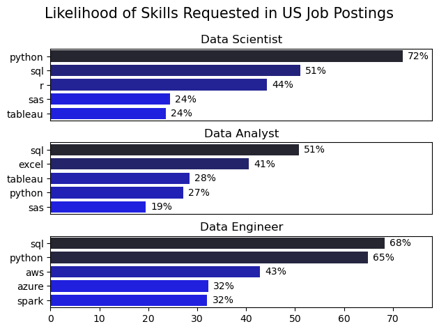
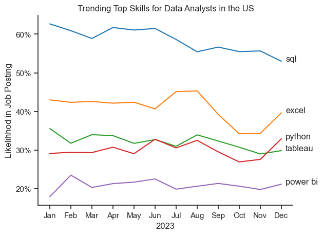
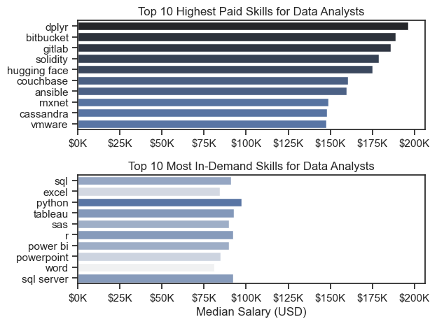
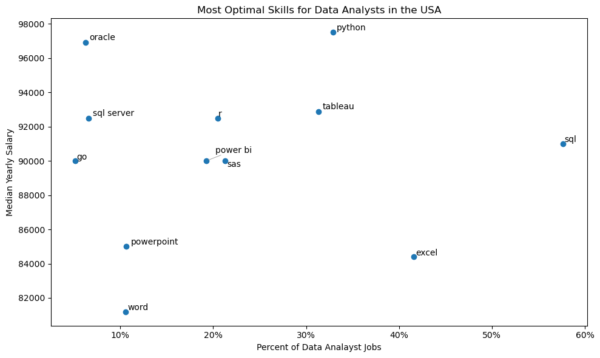

# Overview

Welcome to my analysis of the job market data! This project aims to demonstrate my data analysis skills while continuing to learn Python. The purpose behind this project was to better understand the job market and to inform myself about the future of my career path. As a mostly self-taught learner, I found the process of completing this project very interesting and rewarding.

The data sourced from Luke Barousse's Python Course which provides a foundation for my analysis, containing detailed information on job titles, salaries, locations, and essential skills. Through a series of Python scripts, I explore key questions such as the most demanded skills, salary trends, and the intersection of demand and salary in data analytics.

# The Questions
Below are the questions I want to answer in my project:

- What are the skills most in demand for the top 3 most popular data roles?
-  How are in-demand skills trending for Data Analysts?
- How well do jobs and skills pay for Data Analysts?
- What are the optimal skills for data analysts to learn? (High Demand AND High Paying)

# Tools Used
- Python: Pandas Library, Matplotlib Library, Seaborn Library
- Jupyter Notebooks
- Visual Studio Code
- Git, and Github

## Data Preparation and Cleanup
This section outlines the steps taken to prepare the data for analysis, ensuring accuracy and usability.
# Import and Clean up Data
```python
# Importing Libraries
import ast
import pandas as pd
import seaborn as sns
from datasets import load_dataset
import matplotlib.pyplot as plt  

# Loading Data
dataset = load_dataset('lukebarousse/data_jobs')
df = dataset['train'].to_pandas()

# Data Cleanup
df['job_posted_date'] = pd.to_datetime(df['job_posted_date'])
df['job_skills'] = df['job_skills'].apply(lambda x: ast.literal_eval(x) if pd.notna(x) else x)

```
# Filter for US only
```python
df_US = df[df['job_country'] == 'United States']
```

# The Analysis

## 1. What are the most demanded skills for the top 3 most popular data roles?

To find the most demanded skills for the top 3 most popular roles. O filteres out those positions by which ones were most popular, and got the top 5 skills for these top 3 roles. This query shows which skills I should be learning based on the role I would like to get in my future.

View my notebook with detailed steps here: [2_Skills_Count.ipynb](3_Project/2_Skills_Count.ipynb)

### Visualize Data

```python

fig,ax=plt.subplots(len(job_titles),1)

for i,job_title in enumerate (job_titles):
    df_plot=df_skills_count[df_skills_count['job_title_short']==job_title].head(5)
    df_plot.plot(kind='barh',x='job_skills',y='skills_count',ax=ax[i],legend=False)
    ax[i].set_title(f'Top Skills for {job_title}')
plt.tight_layout()
plt.show()
```

### Results



### Insights
- SQL emerges as the most valuable skill across the top three data-related roles, remaining consistently in demand regardless of the level of technical complexity required.

- Python is the most predominantly demanded skill for Data Scientists, appearing in 72% of job postings, followed closely by Data Engineers at 65%.

- Data Engineers are expected to possess more advanced technical expertise, including cloud and big-data technologies such as AWS, Azure, and Spark. In contrast, Data Scientists and Data Analysts rely more heavily on data management and visualization tools, with strong demand for skills such as Tableau and Excel.-Python is the most predomintaly demanded skill for Data Scientists with a 72% and then Data Engineers with a 65%

## 2. How are in-demand skills trending for Data Analysts? 

View my notebook with detailed steps here: [3_Skills_Trend.ipynb](3_Project/3_Skills_Trend.ipynb)

To see how data analyst skills changed throughout 2023, I focused only on data analyst job postings and tracked which skills showed up the most each month. By grouping the skills by month, I pulled out the top five skills for every month of the year. This helped me see which skills were consistently popular and how demand shifted over time.


### Visualize Data

```python

df_plot=df_DA_US_percent.iloc[:,:5]

sns.lineplot(data=df_plot,dashes=False, palette='tab10')
sns.set_theme(style='ticks')
sns.despine()

plt.title('Trending Top Skills for Data Analysts in the US')
plt.ylabel('Likelihhod in Job Posting')
plt.xlabel('2023')
plt.legend().remove()

from matplotlib.ticker import PercentFormatter
ax= plt.gca()
ax.yaxis.set_major_formatter(PercentFormatter(decimals=0))

for i in range(5):
    plt.text(11.2, df_plot.iloc[-1,i], df_plot.columns[i])

```
###  Results



### Insights 

- SQL continues to be the most prominent skill throughout the year, showing a higher probability of being mentioned in job postings, especially between April and June.

- Excel ranks second, surpassing Python and Tableau. It shows steady demand during the first months of the year, followed by a decline between August and October, and a rebound towards the end of the year.

- Python and Tableau exhibit similar behavior, with fluctuations throughout the year. Python reaches its peak demand in December, while Tableau sees its highest demand in August.

- Finally, Power BI records the lowest values, indicating relatively low demand throughout the year compared to the other skills analyzed.

## 3. How well do jobs and skills pay for Data Analysts?

To figure out which roles and skills pay the most, I focused only on jobs in the United States and compared their median salaries. Before diving into specific skills, I first looked at how salaries differ across common data roles—like Data Scientist, Data Engineer, and Data Analyst—to get a general sense of which positions tend to pay more overall.

View my notebook with detailed steps here: [4_Salary_Analysis.ipynb](3_Project/4_Salary_Analysis.ipynb)


### Visualize Data

```python
sns.boxplot(data=df_US_top6, x='salary_year_avg', y='job_title_short', order=job_order)
sns.set_theme(style='ticks')

plt.title('Salary Distributions in the United States')
plt.xlabel('Yearly Salary (USD)')
plt.ylabel('')
plt.xlim(0, 600000) 
ticks_x = plt.FuncFormatter(lambda y, pos: f'${int(y/1000)}K')
plt.gca().xaxis.set_major_formatter(ticks_x)
plt.show()
```

### Results


#### Insights

- The median Salaries tend to increase with seniority suggesting that experience for this specific career path is highly valuable.

- Data Scientists and Data Engineer roles show a greater amount of outliers suggesting that having better skills will lead to higher paying jobs, while Data Analyst roles show more cosistency with not that many outliers.

- Data Analyst roles have a lower median salary overall compared to Data Scientist and Data Engineer roles which might required more technical skills and sophistacated studies or experience. 

## Salary Analysis(Skills)
View my notebook with detailed steps here: [4_Salary_Analysis.ipynb](3_Project/4_Salary_Analysis.ipynb)

### Visualize Data

```python
fig, ax = plt.subplots(2, 1)  

sns.set_theme(style='ticks')

# Top 10 Highest Paid Skills for Data Analysts
sns.barplot(data=df_DA_top_pay, x='median', y=df_DA_top_pay.index, hue='median', ax=ax[0], palette='dark:b_r')
ax[0].legend().remove()
# original code:
# df_DA_top_pay[::-1].plot(kind='barh', y='median', ax=ax[0], legend=False) 
ax[0].set_title('Top 10 Highest Paid Skills for Data Analysts')
ax[0].set_ylabel('')
ax[0].set_xlabel('')
ax[0].xaxis.set_major_formatter(plt.FuncFormatter(lambda x, _: f'${int(x/1000)}K'))


# Top 10 Most In-Demand Skills for Data Analystsr')
sns.barplot(data=df_DA_skills, x='median', y=df_DA_skills.index, hue='median', ax=ax[1], palette='light:b')
ax[1].legend().remove()
# original code:
# df_DA_skills[::-1].plot(kind='barh', y='median', ax=ax[1], legend=False)
ax[1].set_title('Top 10 Most In-Demand Skills for Data Analysts')
ax[1].set_ylabel('')
ax[1].set_xlabel('Median Salary (USD)')
ax[1].set_xlim(ax[0].get_xlim())  # Set the same x-axis limits as the first plot
ax[1].xaxis.set_major_formatter(plt.FuncFormatter(lambda x, _: f'${int(x/1000)}K'))

plt.tight_layout()
plt.show()
```

### Results



#### Insights
- The top graph shows that more technical skills like dplyr, Bitbucket, and GitLab have higher salaries (around $200K per year), given the level of expertise needed to use them as efficiently as possible.

- The second graph, on the other hand, shows the basic starter package for data analysis—like Excel, SQL, and Tableau—as the most in demand, though these skills do not pay nearly as much as the more technical skills.

- Joining both of these results, the recommendation would be to start with the basics, and if you have the ambition for a higher-paying job in the future, consider learning more knowledge- and expertise-heavy skills.

## 4. Optimal skills for Data Analysts in the US
View my notebook with detailed steps here: [5_Optimal_Skills.ipynb](3_Project/5_Optimal_Skills.ipynb)

## What is the most optimal skill to learn for Data Analysts 

To figure out which skills are the most worth learning—meaning the ones that are both high-paying and in high demand—I calculated how often each skill shows up in job postings and compared that with the median salary for those skills. This made it easier to spot which skills give you the best return for your time and effort.

### Visualize Data

```python

fig, ax = plt.subplots(figsize=(10, 6))

# Scatter plot
ax.scatter(
    df_DA_skills_high_demand["skill_percent"],
    df_DA_skills_high_demand["median_salary"]
)

# Prepare texts for adjustText
texts = []
for i, txt in enumerate(df_DA_skills_high_demand.index):
    texts.append(
        ax.text(
            df_DA_skills_high_demand["skill_percent"].iloc[i],
            df_DA_skills_high_demand["median_salary"].iloc[i],
            str(txt)
        )
    )

```
### Results



### Insights
- Python appears to be the highest-paying and one of the most in-demand skills, with a median yearly salary of about $97,000 and demand around 35%. This suggests a strong need to focus on learning the core concepts of Python for those looking to succeed in the data analytics job market.

- SQL has the highest percentage of demand, even though its median salary is lower than that of more technical and complex skills. Still, SQL offers a relatively high median salary compared to more basic Microsoft skills like PowerPoint or Excel, with about a $10,000 difference and over a 40% higher appearance in job postings.

- For data visualization, Tableau appears to be the stronger skill compared to Power BI, with both a higher median salary and greater demand in job postings.

- Excel, while not among the highest-paying skills, remains highly relevant. With demand above 40%, it is still considered a very useful and widely required skill in the data analytics career path.

## What I learned 


- **Data Cleaning & Filtering:**  
  I learned how important it is to properly clean and filter data in order to get more accurate and reliable insights.

- **High-Paying vs. High-Demand Skills:**  
  Exploring the relationship between high-paying skills and the most in-demand skills helped me build a clearer roadmap of which skills to focus on improving now and which ones to start learning for future growth.

- **Data Visualization for Communication:**  
  I improved my ability to create clear and effective visualizations that communicate insights in a way that’s easy to understand, even for people who don’t specialize in data or analytics.

##  Main Struggles

- **Learning Python from Scratch:**  
  Since this was my first time working with this programming language, remembering syntax and figuring out the best way to translate what I wanted to visualize into code was challenging and sometimes frustrating.

- **Handling Messy Data:**  
  Dealing with missing values and inconsistencies required careful decision-making and highlighted the importance of strong data cleaning skills.

## Conclusion

This project helped me better understand the current job market for data roles while also improving my Python and data analysis skills. By exploring which skills are most in demand and which ones are tied to higher salaries, I was able to build a clearer picture of what skills are worth prioritizing for my own career growth.  

Even though there were challenges along the way, especially with learning a new programming language and handling messy data, the process itself was a valuable learning experience. Overall, this project gave me more confidence in working with real-world data and using visualizations to communicate insights in a clear and meaningful way.
